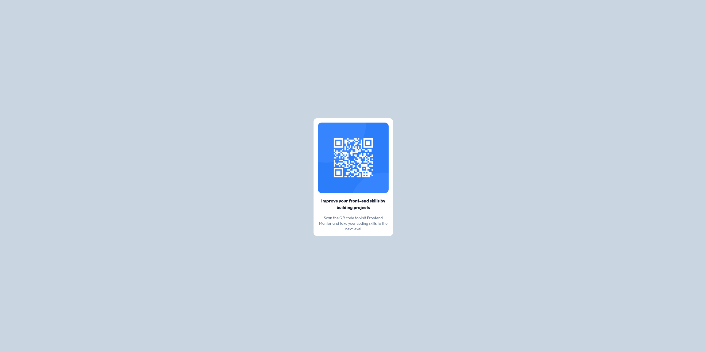

## Frontend Mentor - QR Code Component Solution

This is a solution to the [QR code component challenge on Frontend Mentor](https://www.frontendmentor.io/challenges/qr-code-component-iux_sIO_H).

## Table of contents

- [Overview](#overview)
  - [Screenshot](#screenshot)
  - [Links](#links)
- [My process](#my-process)
  - [Built with](#built-with)
  - [What I learned](#what-i-learned)
- [Author](#author)

## Overview

### Screenshot

### Links

- Solution URL: [https://www.frontendmentor.io/solutions/qr-code-component-GYCF_YRYlX](https://www.frontendmentor.io/solutions/qr-code-component-GYCF_YRYlX)
- Live Site URL: [https://qr-code-component-10.vercel.app/](https://qr-code-component-10.vercel.app/)

## My process

### Built with

- React
- Typescript
- Tailwind CSS

### What I learned

In React, we can't use images with regular paths like in HTML. We need to either put them in the public folder or import them from the src folder.

## Author

- Frontend Mentor - [@krutagna10](https://www.frontendmentor.io/profile/krutagna10)
